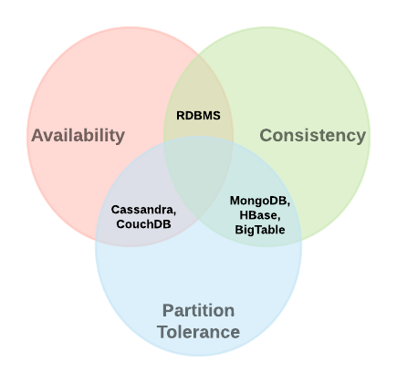

<h1>CAP Theorem</h1>
  
CAP theorem stands for

  <ul>
    <li><b>Consistency:</b> All nodes see same data at the same time.</li>
    <li><b>Availability:</b> All the nodes are always available, and can send response to any request coming their way.</li>
    <li><b>Partition Tolerance:</b> Even if a node goes down, the system continues to function.</li>
  </ul>
  
We can only have any 2 of the 3 properties mentioned above. 
     We always MUST have Partition Tolerance. 
     So we can trade off between either Consistency and Availability.
  

  