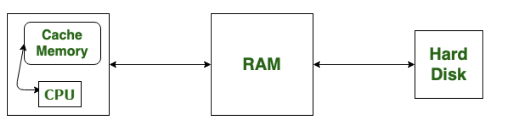
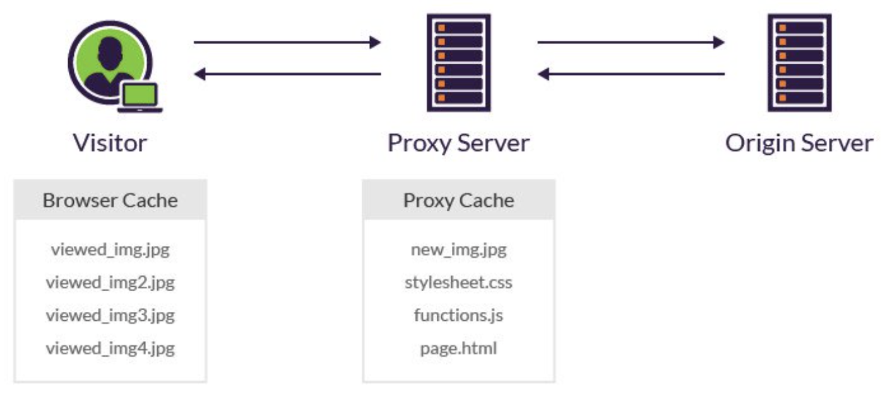
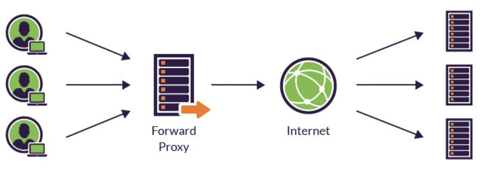
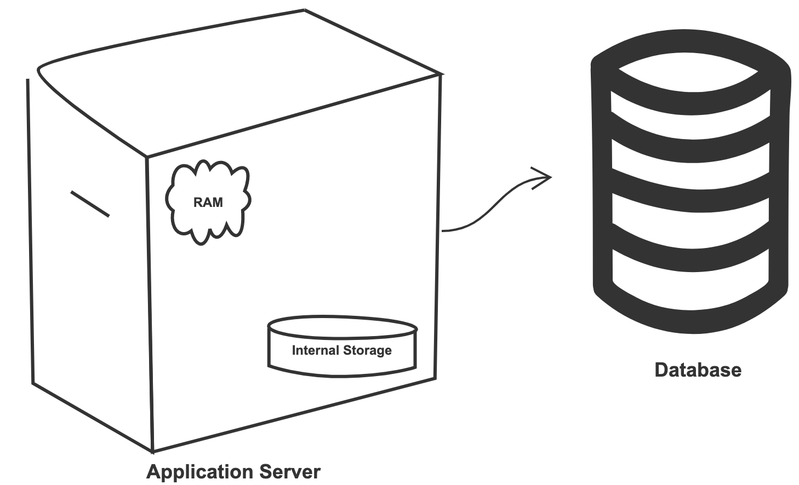
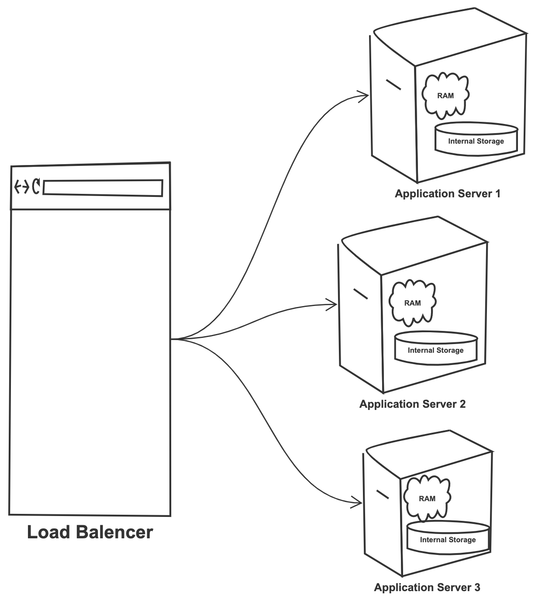
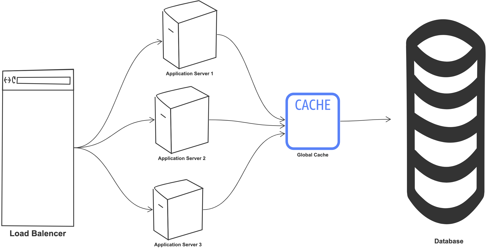
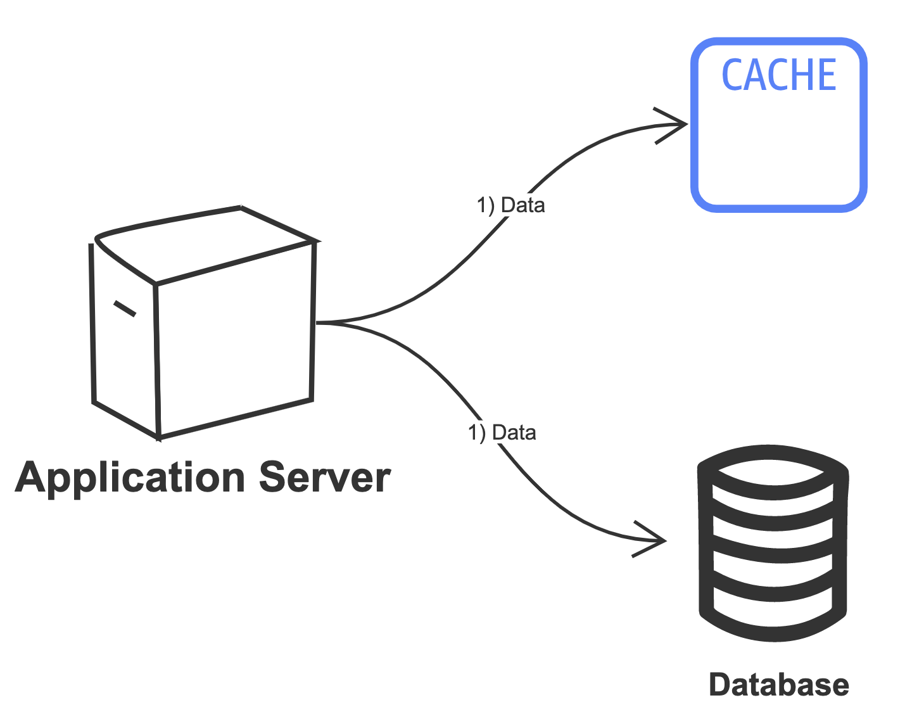
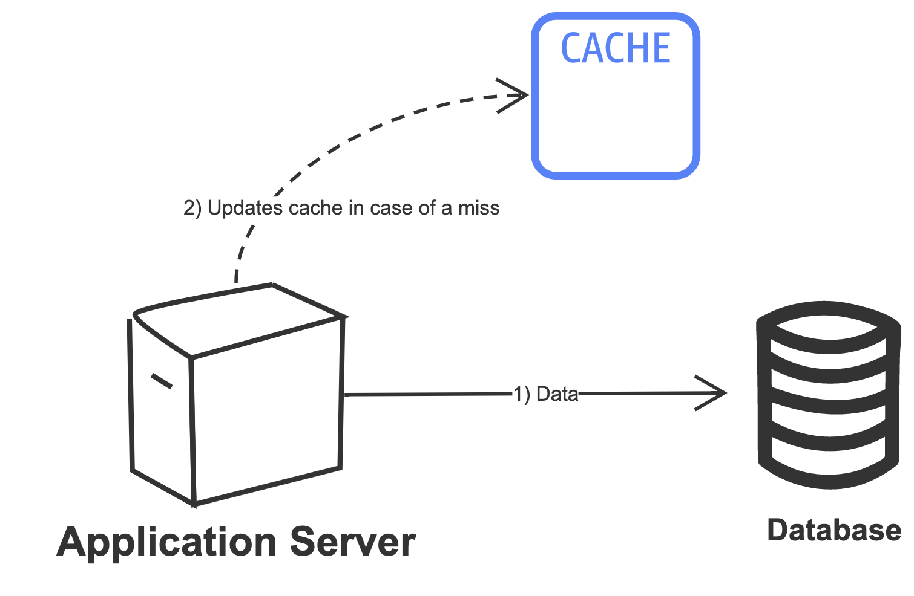
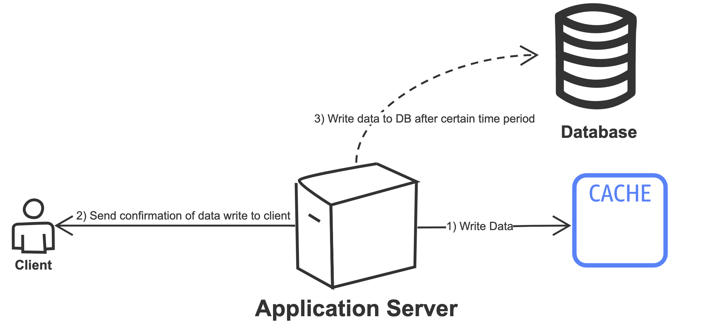
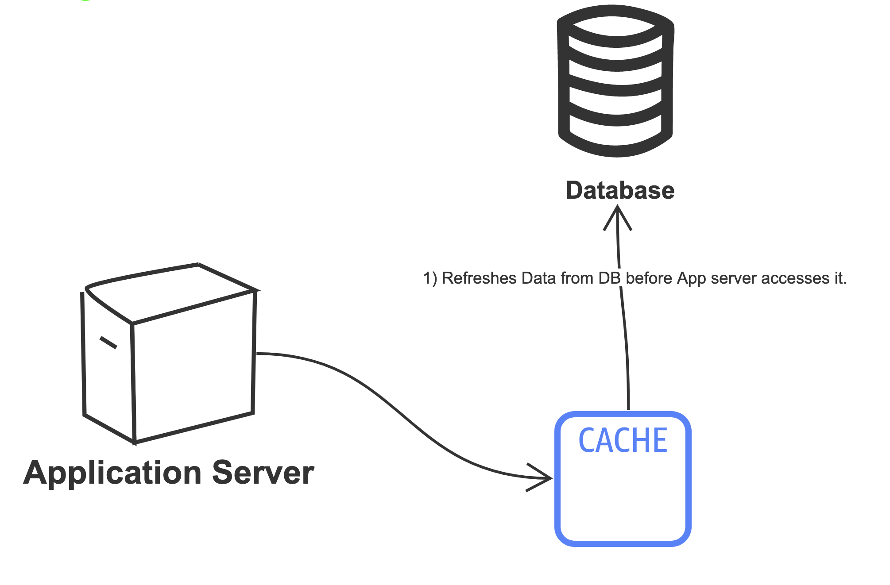

<h1>Cache</h1>
<h2>Goal</h2>
    
Improves page load time and reduces the load on your server and database.
 

<h2>Types of caching</h2>
    <h3>Client Side caching</h3>
    
   <ul>
        <li>Operatig system Cache
            
<b>Note: </b>RAM is not cache, it's just used to store the programs and data being used by the CPU in real-time. 
            It is a hardware component.

            
        </li>
        <li>Browser Cache
            
Involves a visitor’s browser downloading your website’s resources, (e.g., HTML files, JavaScript files and images) to their local drive.

            
<b>Note: </b>Cookies are different, they are employed to store user choices such as browsing session to trace the user preferences.

        </li>
        <li> Proxy Server Caching 
            
<b>Note:</b> Only reverse proxy uses proxy server caching, forward proxy does not use proxy server caching. 
            The below information about reverse and forward proxies is for your information only.
            

            
Traditionally, I wouldn't calssify Proxy server caching as 'Client side caching' but, it's still nearer to client side and not all the way at the server side.

            <ul>
                <li>Reverse Proxy (or CDN):
                    
Website resources are stored in intermediate servers (CDN), instead of your visitor's local drives.

                    
For example, when a visitor accesses a blog with a header image, the proxy server looks for the image in its cache. 
                    If it’s the first time that the image is accessed, the server needs to request it from the origin. 
                    The next time the article is accessed from the proxy server – by <u>any visitor</u> – the image will already be available in the proxy cache.
                    

                    
                </li>
                <li> Forward Proxy:
                    
The most common example of forward proxy is VPN used by your school or work.
                    Forward proxy is placed between user and internet, it regulates incoming and outgoing traffic.
                    

                    
            </ul>      
        </li>
   </ul>

   <h3>Server Side caching</h3>
   
   <ul>
   <li> Database Caching:
       
Helps your primary DB by removing the load from it. 
       You can keep frequently accessed data in this cache. 
       Rather than scavenging for data, you can first check if it’s present in the cache or not.
       

   </li>
   <li> Application server caching:
       
Placing cache on app server can help fetch response quicker.

       
The App server has RAM and internal storage (Just like your computer). 
       Obviously, RAM is very fast but internal storage can be much quicker than going to an external DB server and fetching data from there.
       

       
So we can first check if the requested data is present on app server, if not then we can go to the external DB and fetch it.

       
       
But what happens when you start to scale the system and have many App server nodes ?

       
Those individual app servers can still have their own caches, but if your load balancer distributes the load unevenly, then requests can go to different app servers and this will increase cache misses.

       
       
To overcome this hurdle we can use <b>Global caches</b>

       <ul>
       <li>Global Cache:
           
You can have a global cache for all servers. (Can use Redis or Memcached for this)

           
One big advantage of global cache is that you can scale it independently 

           
       </li>
       </ul>
   </li>
   </ul>
   
   <h3>When to update the cache ?</h3>
   
What happens when the data in the DB gets updated ? 
   We'd also need to update the cache along with it so that it stays consistent.

   
   <ol>
       <li><b>Write through cache:</b>
           
The data is written to both cache and DB at the same time.

           
           
 <b>Pros:</b>
               <ul>
                   <li>Low data read latency</li>
                   <li>Data consistency</li>
                   <li>Partition tolerance, so in case of a failure you have backup (if DB goes down you can copy from cache and vice versa) </li>
               </ul>
               <b>Cons:</b>
               <ul>
                   <li>Higher latency during write.</li>
               </ul>               
               <b>What is it good for?</b>
               <ul>
                   <li>For applications that write not that frequently but re-read data frequently. So essentially a read heavy system.</li>
               </ul>
           

       </li>
       <li><b>Write around cache:</b>
           
Data is directly written to DB. Cache only gets updated in case of a miss.

           
           
 <b>Pros:</b>
               <ul>
                   <li>Won't flood the cache with new data that may not be immediately re-read.</li>
               </ul>
               <b>Cons:</b>
               <ul>
                   <li>But if you try to read the recently written data, that will create a cache miss and thus higher read latency.</li>
               </ul>
               <b>What is it good for?</b>
               <ul>
                   <li>Applications that don't read as frequently, since write will be faster but reads can be slower. So essentially a write heavy system.</li>
               </ul>
           

       </li>
       <li><b>Write Back cache:</b>
           
Data is first written to cache, the confirmation of this is sent to client. 
           After certain time period(or some other conditions) the data is then written to DB.

           
           
 <b>Pros:</b>
               <ul>
                   <li>Data written has low latency and high throughput. (Throughput is the rate at which something is processed)</li>
               </ul>
               <b>Cons:</b>
               <ul>
                   <li>What if the cache fails before the data is written to DB ? So availability is at risk.</li>
                   <li>You'd need to have cache backups to save it from the possibility of data loss, this can be a bit expensive.</li>
               </ul>
               <b>What is it good for?</b>
               <ul>
                   <li>Applications that write a lot and read that newly written data, so essentially both write and read heavy applications.</li>
               </ul>
           

       </li>
       <li><b>Refresh Ahead Cache:</b>
           
Sometimes the entries in your cache can have certain time to live (TTL) before they expire.
           In refresh ahead cache the data is refreshed once before it expires.
           

           
The cache needs to accurately predict what data it needs to refresh, 
           so as to not refresh data that won't be accessed and waste a DB call behind it.
           

           
           
 <b>Pros:</b>
               <ul>
                   <li>Reduced read latency.</li>
               </ul>
               <b>Cons:</b>
               <ul>
                  <li>If cache can't accurately predict what data to refresh, it can lead to reduced preformance.</li>
               </ul>
               <b>What is it good for?</b>
               <ul>
                   <li>Read heavy applications that need frequent data refresh.</li>
               </ul>
           

       </li>
   </ol>
   
   <h3>Cache eviction policies</h3>
   <ul>
       <li>Least recently used (LRU)</li>
       <li>Least frequently used (LFU)</li>
      <li>Time to Live: in distributed system, there is often data retention policy to make sure that there is space for new data. The amount of time the data gets to live on the server is called Time to live (TTL)</li>
   </ul>

<h2>Distributed Caching</h2>
  
The cache can either reside on the application server as mentioned in Server side caching above. Or we can implement it as an individual cluster separate from the application servers see global cache in server side cache.

  
<h2>Considerations for using Cache</h2>
  <ul>
    <li>Consider using cache when the data is read frequently but modified infrequently</li>
    <li>Cache is a volatile memory, so if a cache server is restarted all data in it is lost</li>
    <li>Generally a good practice to have TTL (time to live) on the cached data, and make sure the expiration data is not set too far in future (data can become stale) or too near in future (too many cache misses and having to frequently load from DB)</li>
    <li><b>Consistency</b>: we need to make sure that DB and cache are in sync but when we are scaling across multiple regions, maintaining consistency between cache and DB becomes very challenging</li>
  </ul>
  

<h1>Good Reads</h1>
  <a href="https://igotanoffer.com/blogs/tech/caching-system-design-interview">Caching from igotanoffer</a> 
  <a href="https://www.jyt0532.com/2017/03/27/system-design/">System Design-Design cache by jyt0532</a>
