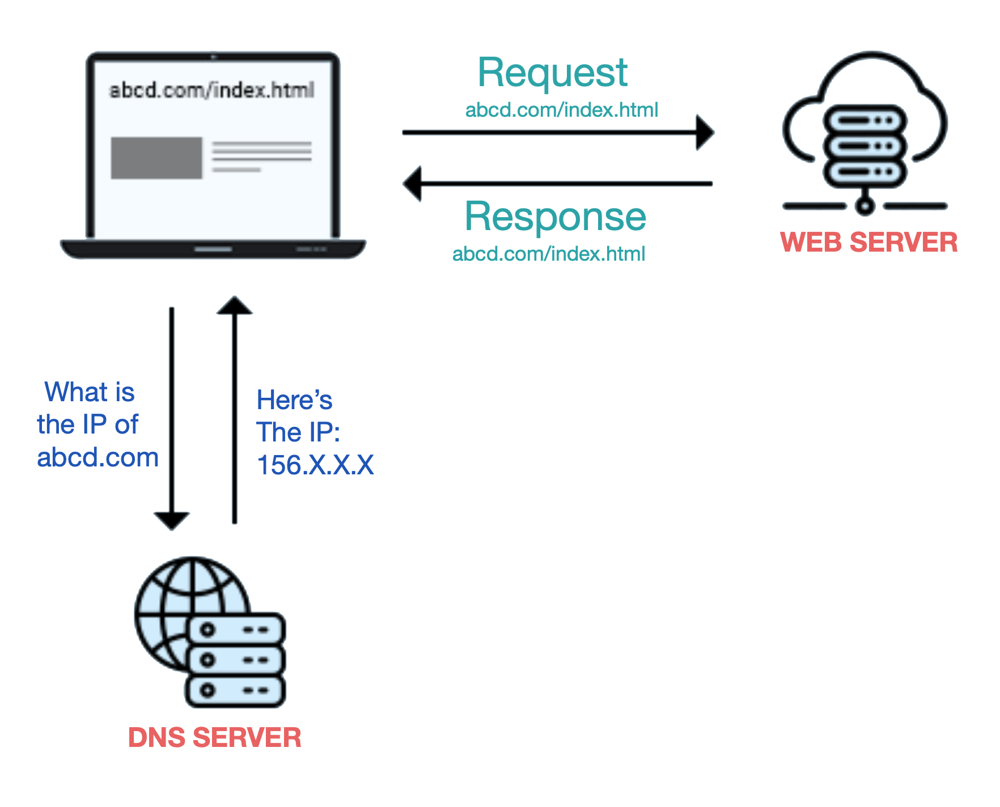

<h1>Domain Name System (DNS)</h1>
  
You can think of DNS as the Phone book of the internet. 
    Each device (or server) connected to the internet has a unique IP address, this IP address is used by other devices to find that device (or server). 
    A DNS service translates human readable names like www.example.com into the numeric IP addresses that computers use to connect to each other.
  

  
  <h2>Good Reads</h2>
  <ul>
    <li><a href="https://www.cloudflare.com/learning/dns/what-is-dns/">What is DNS ? by Cloudflare</a></li>
    <li><a href="https://aws.amazon.com/route53/what-is-dns/">What is DNS ? Article by AWS</a></li>
  </ul>
  
  
  