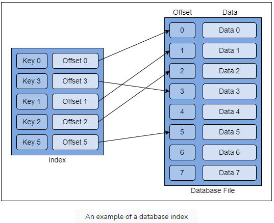
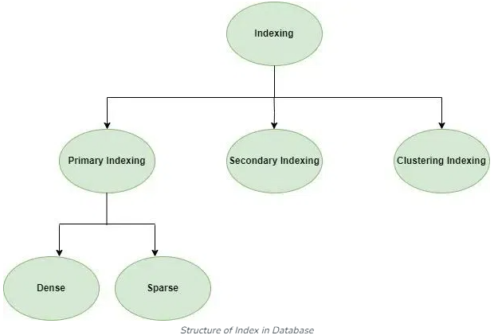
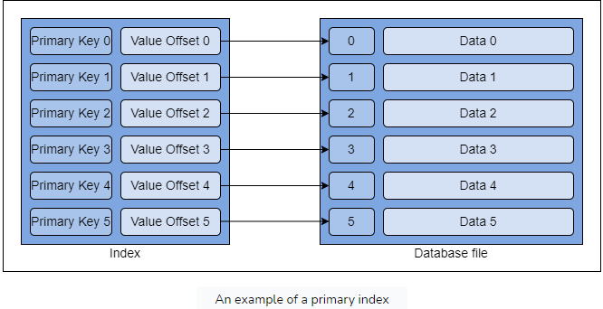
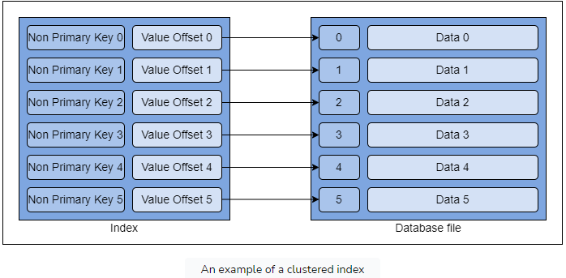
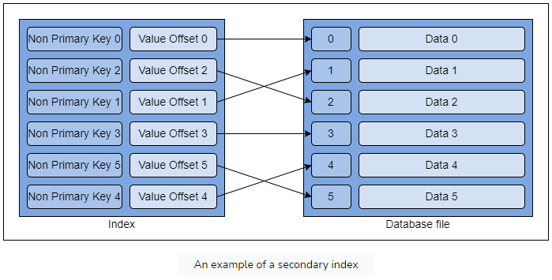
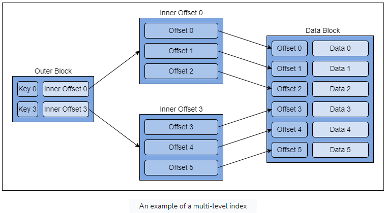
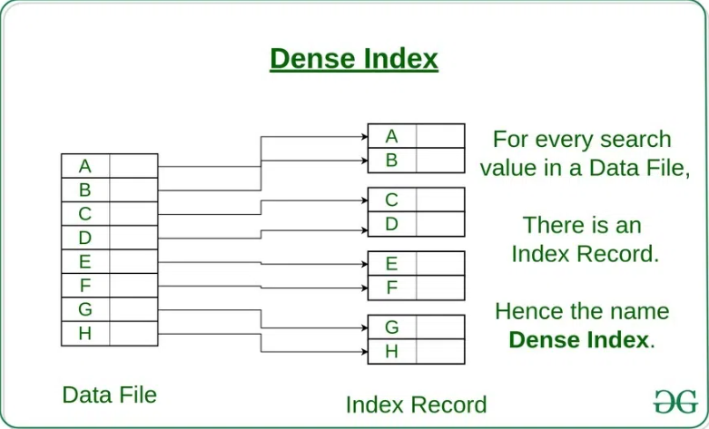
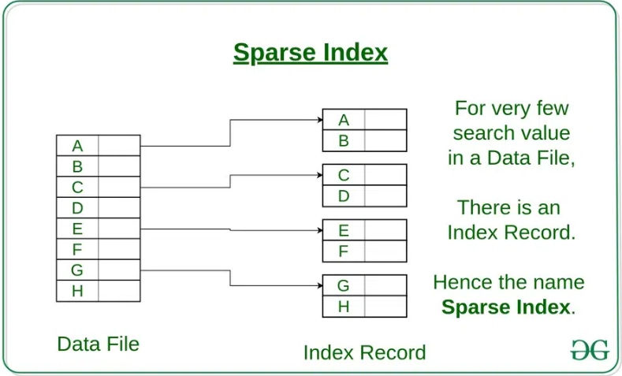

# Database Indices
A database index is a data structure that improves the speed of data retrieval operations on a database table.

A database index is an additional data structure that allows us to locate the required data quickly without going through the entire dataset in the database.
It acts as a pointer to the corresponding data on disk without scanning the entire database dataset.

Typically, indexes are implemented as sorted data structures, such as B-trees or hash tables. These structures allow the database system to quickly locate the rows that match a particular value or range of values.

When you query the database for data based on the indexed column(s), the database engine first consults the index to find the relevant entries. This significantly reduces the number of rows that need to be scanned in the table, resulting in faster query performance.

## Trade-offs
While indexes improve query performance, they also come with some trade-offs. Indexes consume additional storage space and incur overhead during data modification operations (such as inserts, updates, and deletes), as the database system needs to maintain the index structure to keep it in sync with the underlying table data.

Introducing multiple indexes in the database significantly impacts the write performance.

## Structure of Index in DB

## Single-level VS Multi-level Indexing
### Single-level
Single-level indexing is a type of indexing that has only one level. An index entry directly points to an offset of the block on disk.

We can further classify single-level indexing into three categories:
1. Primary Index: A primary index is a type of index created on the record's primary key.

2. Clustered Index: A clustered index is an index created on the record's nonprimary key.

3. Secondary Index: A secondary index is an index created on the record's nonprimary key. But the index and database entries are unordered.

### Multi-level
Multi-level indexing is a type of indexing that has multiple levels.
Multi-level indexing segregates the index structure into smaller blocks.

## Dense index versus sparse index
### Dense Index
The dense index is a type of index where every record in the data file on disk has a corresponding search key in the index data structure

### Sparse Index
The sparse index is a type of index where the search key in the index data structure exists only for some of the records in the database file.

#### Locating Record
- Find a key that is less than the search key and closest to the search key.
- Do a disk seek to find the anchor record from the matching key in the first step.
- Load the disk block and sequentially compare the record keys to find the desired record.
