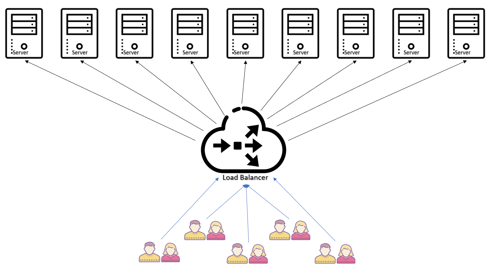
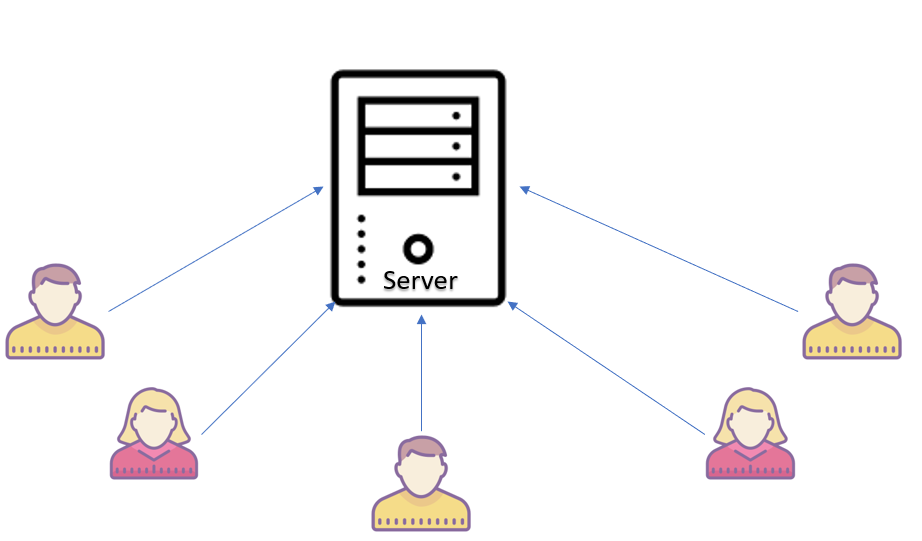
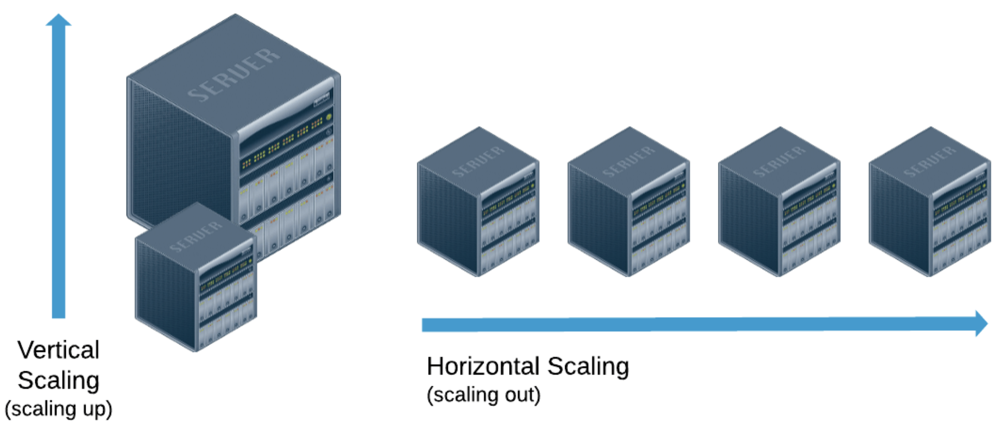

<h1>Horizontal Scaling</h1>
  
Horizontal scaling means scaling by adding more machines to your pool of resources.

  
One of the fundamental differences between the two is that horizontal scaling requires breaking a sequential piece of logic into smaller pieces so that they can be executed in parallel across multiple machines. 

  <ul>
    <li>We horizontal scale by adding several small servers/machines.</li>
    <li>We need a load balancer to balance the load amongst all other machines.</li>
    <li>If one of the machine fails, you can redirect the request to the several other machines</li>
    <li>What ever communication we have between the machines, it is over the network, and networks are usually slow as comapred to inter-process communication</li>
    <li>Data can be inconsistent, because there are several machines, it may take some time for machines to copy data from other machines</li>
    <li>Scales well, we can add as many servers/machines as we like</li>
  </ul>
  
  
<b>Databases running horizontal scaling:</b> Cassandra, MongoDB, Google Cloud Spanner

 

<h1>Vertical Scaling</h1>
  
Vertical scaling means, scaling by adding more power (e.g. CPU, RAM) to an existing machine.

  
Vertical scaling is easier because the logic really doesn't need to change. Rather, you’re just running the same code on higher-spec machines.

  <ul>
    <li>We vertical scale by adding more power to our existing server</li>
    <li>We can increase power of our existing machine by adding more processing power, giving it more storage, etc</li>
    <li>We dont require a load balancer since there is just one big system</li>
    <li>But if this one big system fails then the entire service goes down</li>
    <li>If we want to communicate between 2 independent systems, then we have inter process communication thats faster.</li>
    <li>The data just resides on one system, so data will always be consistent</li>
    <li>There will eventually be some hardware limitaitons, so it eventually won't scale</li>
  </ul>
  
  
<b>Databases running vertical scaling:</b> MySQL, Amazon RDS

