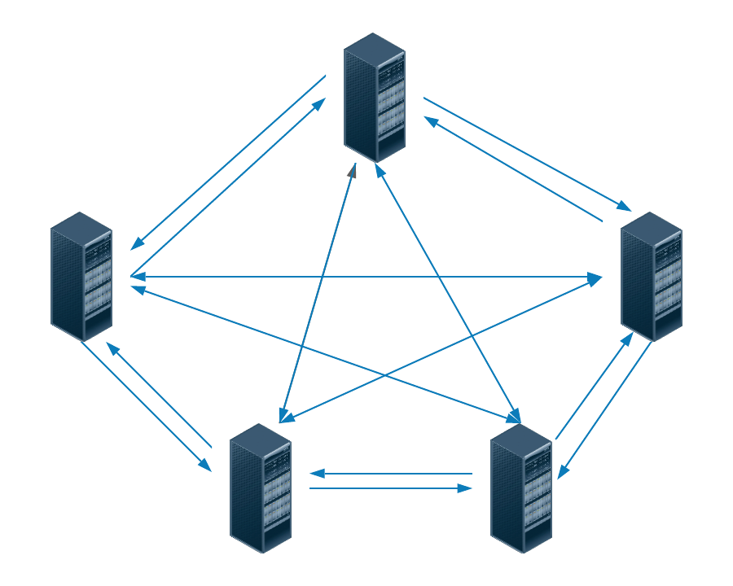

<h1>Gossip Protocol</h1>
  
In a cluster, if there is no central node that keeps track of all the nodes, how do all the other nodes know <b>if a node is down or not</b> ?

  <h2>Heartbeat Protocol</h2>
    
Every node maintains a heartbeat with every other node. However, this means we are exchanging O(n^2) packets.

     
  <h2>Gossip Protocol</h2>
    
In this protocol nodes periodically exchange information about themselves and about other nodes they know about.

    
Each node initiates a gossip round, where it tells information about itself and other nodes it knows about to one other node.

    
With this mechanism eventually the nodes come to know about the state of other nodes.

  <h2>Use case</h2>
    
Dynamo and Cassandra are the Databases that use this protocol.
