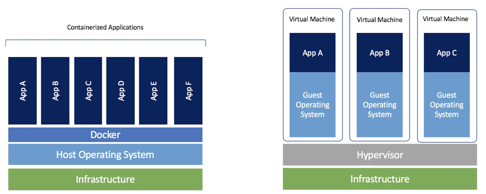

<h1>Docker</h1>
  
 Imagine you develop your application and want the tester to run it and test it. 
    However, the tester doesn't have the same environment as the developer does.
    So what do you do ? You create a virtual machine and install the application there and send the VM to the tester. 
    Docker is kinda like the VM but better. 
  

  <h2>What is Docker</h2>
    
Docker is a tool that provides you with containers to deploy your application in.  
      The container is a software package that provides the application with all the dependencies it requires to execute.  
      The containers all can run on same hardware but each of them can have their own configuration.  
      Docker takes away repetitive, mundane configuration tasks and is used throughout the development lifecycle for fast, easy and portable application development
    

  <h2>Virtual Machine VS Docker</h2>
    
  <h2>Good Reads</h2>
    <ul>
      <li><a href="https://www.youtube.com/watch?v=rOTqprHv1YE">Docker tutorial by Simplilearn</a> </li>
    </ul>
  
  