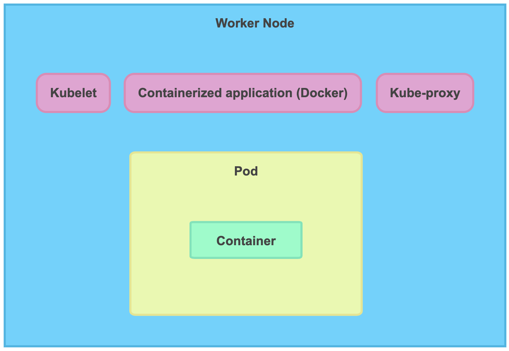

<h1>Kubernetes</h1>
  

    Kubernetes, also known as K8s, is an open-source system for automating deployment, scaling, and management of <b>containerized applications such as docker</b>.
    K8s is mainly used with micro-service architecture and helps in horizontal scaling of the application.
 

  <h2> Uses of K8s </h2>
    <h3>What if a container goes down </h3>
      

        K8s will check health of every container that it is managing. If it notices that a container has failed then it either restarts it or spins up a new container depending on how it’s programmed. 
      

    <h3> What if a container is getting a lot of traffic </h3>
      

        If K8s notices that one container is getting a lot of traffic then it will spin up multiple instances of that container and evenly distribute the traffic going in each container.
      

    <h3> Some other uses of K8s </h3>
      <ul>
        <li>Easy rollback</li>
        <li>Automatically configures your infrastructure.</li>
        <li>Speeds up deployment</li>
        <li>Allows you to build complex apps</li>
      </ul>
  <h2>Kubernetes Cluster</h2>
    The K8s cluster consists of the master node and the worker node.
    <ul>
      <li><b>Worker Node:</b> A K8s cluster can have 1 to many worker nodes. Think of these worker nodes as computer machines, they run the container in a pod. Containerized applications such as docker are installed on these worker nodes. The worker node has a kubelet that manages the communication with the master node amongst other things.</li>
      
      <li><b>Master Node:</b> A K8s cluster can have 1 to many master nodes. The master node is responsible for maintaining the worker nodes and the pods that are running within them. We can communicate with the master node with help of API server that's present on the master node. The master node also hosts a scheduler, this scheduler is responsible for managing the capacity of the worker node.</li>
    </ul>
  <h2>Good Reads</h2>
    <ul>
      <li><a href="https://www.youtube.com/watch?v=llf65JSPmDY&ab_channel=LaithAcademy">Kubernetes Crash Course</a></li>
    </ul>
