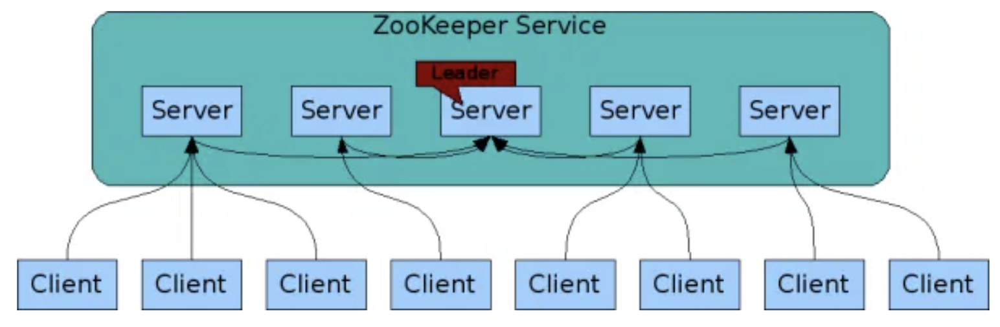

<h1>Zookeeper</h1>
  
Apache Zookeeper is an open source distributed <b>coordination service</b> that helps to manage a large set of servers.  
    It helps you with maintaining configuration information , naming , providing distributed synchronization, and providing group services.  
    So, essentially it's just a piece of software that runs on all your servers and manages them.
  

  <h2>Architecture</h2>
    
 Zookeeper follows a Master-Slave architecture. If the master fails, then one the slaves is elected as the new master.
      All the servers must know about each other.   
      Clients can connect to a single zookeeper server. however, when a client is started they are provided a list of servers, so when a connection to the connected server fails then the client can connect to any other server in the cluster.
    

    
  <h2>Advantages</h2>
    <ol>
      <li>Simple distributed coordination process</li>
      <li>Reliability</li>
      <li>Serialization − Encode the data according to specific rules. Ensure your application runs consistently. This approach can be used in MapReduce to coordinate queue to execute running threads.</li>
    </ol>
  <h2>Good Reads</h2>
  https://dzone.com/articles/an-introduction-to-zookeeper-1  
  https://stackoverflow.com/questions/3662995/explaining-apache-zookeeper  
  https://www.guru99.com/zookeeper-tutorial.html
  
  