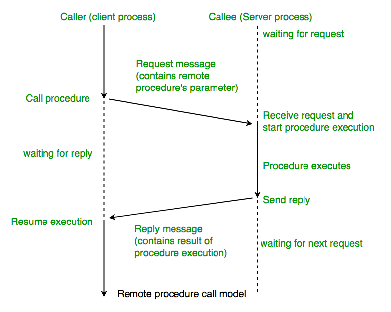
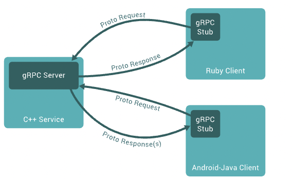

<h1>Remote Procedure Call (RPC)</h1>
  
Remote Procedure Call is a software communication protocol that one program can use to request a service from a program located in another computer on a network.

  
  
RPC uses the client-server model. The requesting program is a client, and the service-providing program is the server.

<h1>gRPC</h1>
  
A framework created by google to work with remote procedure calls.  In gRPC, a client application can directly call a method on a server application on a different machine as if it were a local object.

  
<h1>Good Reads</h1>
  <ul>
    <li><a href="https://www.techtarget.com/searchapparchitecture/definition/Remote-Procedure-Call-RPC">Remote Procedure Call (RPC)</a></li>
    <li><a href="https://www.geeksforgeeks.org/remote-procedure-call-rpc-in-operating-system/">Remote Procedure Call (RPC) in Operating System</a></li>
    <li><a href="https://grpc.io/docs/what-is-grpc/introduction/">Introduction to gRPC</a></li>
  </ul>