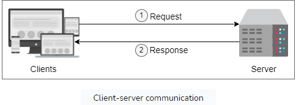
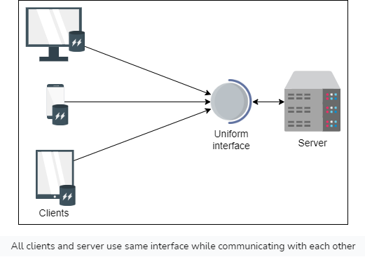
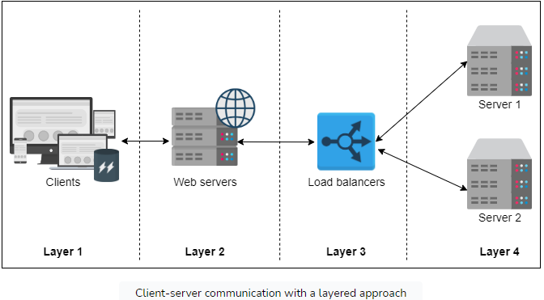
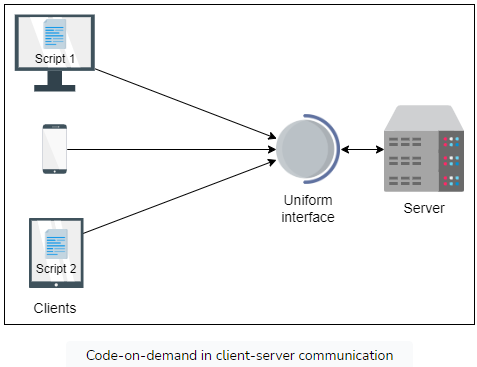

# REST API
A REST API (Representational State Transfer API) is a type of API that adheres to the principles of REST architectural style and uses HTTP requests to access and manipulate data.

## Key Principles of REST APIs
1. **Client-Server Architecture:** REST APIs strictly adhere to a client-server architecture where the client and the server act independently. 
The server provides services, and the client consumes these services. 
The client communicates with the server via the Internet (connector), waiting for a request to be processed by the service. 
The client's request is either rejected or fulfilled by the server, which is communicated back to the client via a response.

2. **Cacheable:** Resources should be cacheable where possible. Caching can eliminate the need for some client-server interactions, which can enhance the efficiency and performance of the application.

3. **Stateless:** Each request from a client to a server must contain all the information the server needs to understand and respond to the request. In other words, the server does not store any client context (or session) on the server between requests. Any session state is held in the client.

4. **Uniform interface:** Since a system is composed of several components, for a system to work in the desired way, the components' interaction should be directed by a uniform interface.

5. **Layered System:** A client cannot ordinarily tell whether it is connected directly to the end server, or to an intermediary along the way.

6. **Code-on-demand:** This constraint enables web servers to send executable programs (code) to clients, such as plug-ins, scripts, applets, and so on. For example, certain applications require additional plug-ins to be installed on the client side. 

