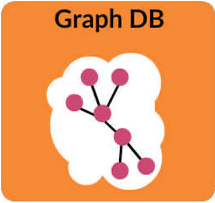

<h1>Relational Database</h1>
  
A relational database is simply a database that uses a relational data model, which organizes data in tables with rows of data entries and columns of predetermined data types. Relationships between tables are represented with foreign key columns that reference the primary key columns of other tables. More on Relational databases <a href="RDBMS/README.md">here</a>. 

  <h2>Advantages</h2>
    <ul>
      <li>They work with structured data.</li>
      <li>Faster query response times.</li>
      <li>They are excellent at keeping data transactions secure.</li>
      <li>They support ACID theorem</li>
    </ul>
  <h2>Disadvantages</h2>
    <ul>
      <li>The biggest disadvantage of relational databases is that they are hard to scale over distributed clusters (horizontal scaling).</li>
      <li>They aren't particularly advantageous if the data has little to no structure and changes shape frequently.</li>
    </ul>
  

<h1>Non-relational Database</h1>
  
Non-relational database uses a storage model optimized for specific requirements of the type of data being stored.

  
Non-relational databases are either AP databases or CP databases. In the case of AP non-relational databases, the model of eventual consistency is used.

  
<b>Comparing to SQL</b>: NoSQl cannot be compared to SQL in any way. Document DBs, Key-Value DBs, Event DBs are all NoSQL. They are all different in almost all aspects, be it structure of saved data, querying, performance and available tools.

  <h2>Types of Non-relational Databases</h2>
    
The types of non-relational databases with their examples are:

    <ul>
      <li>Graph Database
        <ul><li>Neo4J and CosmosDB</li></ul>
        
      </li>
      <li>Document Store
        <ul><li>MongoDB, Couchbase, Firebase, CouchDB, and DynamoDB.</li></ul>
        
      </li>
      <li>Key-Value Store
        <ul><li><a href="Redis/README.md">Redis</a>, DynamoDB, CosmosDB, <a href="Memcached/README.md">Memcached</a>, and Hazelcast</li></ul>
        
      </li>
      <li>Column-Family Database
        <ul><li><a href="Cassandra">Cassandra</a>, HBase, and CosmosDB.</li></ul>
        
      </li>
      <li>Search Engine Database
        <ul><li>Elasticsearch, Splunk, and Solr</li></ul>
      </li>
      <li>Time Series Database
        <ul><li>InfluxDB, Kdb+, and Prometheus</li></ul>
      </li>
    </ul>
  <h2>Advantages</h2>
    <ul>
      <li>They work with data that has little to no structure.</li>
      <li>They provide scalability and flexibility to meet changing business requirements</li>
      <li>In order to support ACID developers will have to implement their own code, making their systems more complex.</li>
      <li>Some of them support BASIC theorem, (some do support ACID theorem though, you just need to know which one)</li>
    </ul>

<h1>Good reads</h1>
  <a href="https://softwareengineering.stackexchange.com/questions/175542/why-is-nosql-faster-than-sql">Why is No-SQL faster than SQL ?</a> 
  <a href="https://www.pluralsight.com/blog/software-development/relational-vs-non-relational-databases">Relational vs Non-relational databases</a> 
