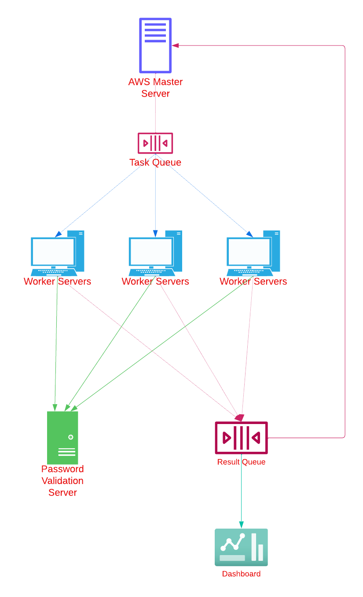

# Password Cracking system
Design a system for a brute-force password-cracking service using the following components:

1. **Black Box System**: Validates whether the generated password is correct.
2. **AWS Instances**: Available for use at a cost.
3. **Standalone Servers**: Free-of-cost worker servers.

The system design should be as cost-effective and efficient as possible.

## Non-functional Requirements
- Minimize the cost
- Maximize the speed

## System Components
- **Black Box System:** This system will validate if the generated password is correct. We will assume it has an API endpoint for validation.
- **AWS Instances:** These instances will be used judiciously due to their cost. They can be used for managing the distribution of tasks and more complex processing requirements.
- **Standalone Worker Servers:** These servers are free and will be used to generate and test passwords. They can run simple scripts to generate passwords and send them to the black box system for validation.

## High level diagram
The design revolves around a master-worker architecture, where a central system (Master Node) coordinates multiple workers (Worker Nodes) that generate and check password candidates.

## Design Overview
### Step 1: Master Node Setup
- **Central Coordinator:** Runs on a lightweight AWS instance or one of the WS. It distributes tasks, collects results, and manages workload distribution.
- **Task Queue:** A managed queue (AWS SQS or similar) to distribute password attempts to various workers.
- **Result Queue:** To collect feedback from worker nodes about the password attempts.
- **Monitoring and Scaling:** Monitors task completion rate and can scale workers up or down. Could potentially use AWS Auto Scaling to manage AWS instance utilization based on workload.

### Step 2: Worker Nodes Configuration
- **Password Generation:** Each WS will generate password attempts based on a given range or pattern. This can be done using a simple iterative algorithm or more complex strategies like masked attacks.
- **Password Submission:** Workers will submit generated passwords to the BBS and listen for validation.
- **Result Reporting:** Workers report back to the Master Node via the Result Queue.

### Step 3: Password Checking Mechanism
- **Parallel Processing:** Distribute different sets of potential passwords to different workers to maximize the use of parallel processing.
- **Rate Limiting and Error Handling:** Ensure the system respects any API rate limits of the BBS and handle errors gracefully without losing progress.

### Step 4: Monitoring and Management
Implement a dashboard or monitoring service (AWS CloudWatch, Grafana) to track the progress, resource usage, and efficiency of the password cracking operation.
