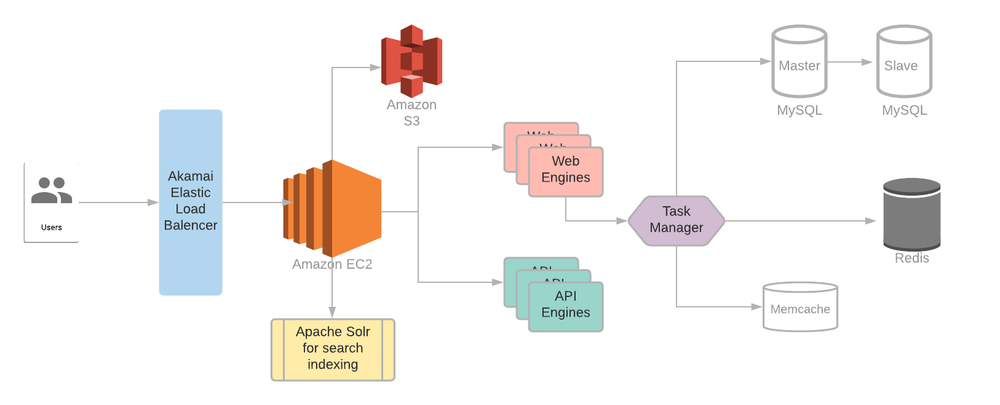

<h1>Pinterest Architecture</h1>
  
This article is my understanding of <a href="http://highscalability.com/blog/2013/4/15/scaling-pinterest-from-0-to-10s-of-billions-of-page-views-a.html">Scaling Pinterest - From 0 To 10s Of Billions Of Page Views A Month In Two Years</a> 

  
The Biggest takeaways:  
    Architecture is doing the right thing when <b>growth can be handled by adding more of the same stuff. You want to be able to scale by throwing money at a problem</b> which means throwing more boxes at a problem as you need them. If your architecture can do that, then you’re golden.
  

  <h2>High Level Diagram</h2>
    
  <h2>Why Amazon EC2/S3?</h2>
    <ul>
        <li>Good reliability</li>
        <li><b>This is a very startupy part:</b> EC2 has all these parts like, their managed cache, load balancing, map reduce, managed databases etc that you don’t have to write yourself. You can bootstrap on Amazon’s services and then evolve them when you have the engineers.</li>
        <li>New instances available in seconds, you don’t have to worry about capacity planning.</li>
        <li>Essentially there is this ease of use that AWS provides.</li>
    </ul>
  <h2>Why MySQL?</h2>
    <ul>
        <li>Free - important when you don’t have any funding initially.</li>
        <li>Ease of use.</li>
        <li>Very solid. It’s never gone down for them and it’s never lost data.</li>
    </ul>
  <h2>Why Memcache?</h2>
    <ul>
        <li>Free</li>
        <li>Simple to use</li>
        <li>Consistently good performance.</li>
    </ul>
  <h2>Why Redis?</h2>
    <ul>
        <li>Free</li>
        <li>Ease of use</li>
        <li>Provides a variety of data structures.</li>
        <li>Has good backup and replication</li>
        <li>Good performance</li>
    </ul>
  <h2>Why Solr?</h2>
    <ul>
        <li>A great get up and go type product. Install it and a few minutes later you are indexing.</li>
        <li>Initially this was used for elastic search, but it had problem scaling.</li>
    </ul>

<h1>Clustering Vs Sharding</h1>
  
During rapid growth they realized they were going to need to spread their data evenly to handle the ever increasing load.

  <h2>Clustering - Everything Is Automatic</h2>
    <h3>Example Databases</h3>
      
Cassandra, MemBase, HBase  
        Essentially all AP systems.
      

    <h3>Properties</h3>
      
<b>Note:</b> In all AP systems, we care about availability more than consistency.  
        When I looked at Cassandra's architecture, there was no master/slave approach. 
        Instead, all nodes were considered masters and communicated with each other.
      

      <ul>
        <li>Nodes communicate with each other. A lot of crosstalk, gossiping and negotiation.</li>
        <li>Rebalance to distribute capacity</li>
      </ul>
    <h3>Pros:</h3>
      <ul>
        <li>High Availability</li>
        <li>No single point of failure</li>
      </ul>
    <h3>Cons:</h3>
      <ul>
        <li><b>Fundamentally complicated.</b> The nodes have to be in symmetrical agreement, which is a hard problem to solve in production.</li>
        <li>Less community support.</li>
        <li>Cluster Management Algorithm is a Single Point Of Failure. If there’s a bug it impacts every node.
          <ul>
            <li><b>Data corruption across all nodes.</b> What if there’s a bug that sprays badness into the write log across all of the nodes. Your read latencies increase. All your data is screwed and the data is gone.</li>
            <li><b>Improper balancing that cannot be easily fixed.</b></li>
            <li><b>Data authority failure.</b> Clustering schemes are very smart. In one case they bring in a new secondary. At about 80% the secondary says it’s primary and the primary goes to secondary and you’ve lost 20% of the data. Losing 20% of the data is worse than losing all of it because you don’t know what you’ve lost.</li>
          </ul>
        </li>
      </ul>
  <h2>Sharding - Everything Is Manual</h2>
    <h3>Properties</h3>
      <ul>
        <li>Data distributed manually</li>
        <li>Data does not move.</li>
        <li>Nodes are not aware of each other. A master node controls everything.</li>
      </ul>
    <h3>Pros:</h3>
      <ul>
        <li>High availability</li>
        <li>Can split your database to add more capacity.</li>
      </ul>
    <h3>Cons:</h3>
      <ul>
        <li>Can’t perform most joins. Because the data is distributed across several DBs</li>
        <li><b>Not ACID:</b> Lost all transaction capabilities. A write to one database may fail when a write to another succeeds.</li>
        <li>Schema changes require more planning.</li>
      </ul>
    <h3>When To Shard?</h3>
      <ul><li>If your project will have a few TBs of data then you should shard as soon as possible.</li></ul>
      
So why did Pinterest start to shard ?

      
When the Pin table went to a billion rows the indexes ran out of memory, they picked the largest table and put it in its own database.
        Then they ran out of space on the single database. Then they had to shard.
      

    <h3>Shard Structure</h3>
      <ul>
        <li>The user ID had shard location built into it. This allowed for faster lookup</li>
        <li>New users are randomly distributed across shards.</li>
        <li><b>All data (pins, boards, etc) for a user is collocated on the same shard.</b> Rendering a user profile, for example, does not take multiple cross shard queries. It’s fast.</li>
      </ul>

<h1>Lessons Learned</h1>
  <ul>
    <li>It will fail. Keep it simple.</li>
    <li>Architecture is doing the right thing when growth can be handled by adding more of the same stuff. You want to be able to scale by throwing money at the problem by throwing more boxes at the problem as you need them. If your architecture can do that, then you’re golden.</li>
    <li>To handle rapid growth you need to spread data out evenly to handle the ever increasing load.</li>
    <li>The least data you move across your nodes the more stable your architecture. This is why they went with sharding over clusters.</li>
  </ul>