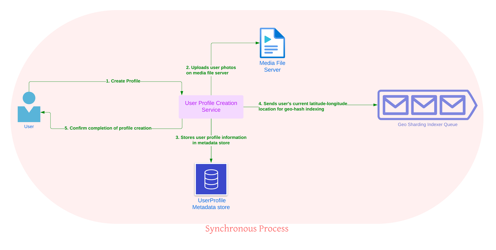

  
<h2>Requirements</h2>

<h3>Functional</h3>

1. User should be able to create their Tinder profile by adding their bio and uploading photos.
2. Users should be able to view other users nearby, based on their geographic region.
3. Users should be able to like or dislike other users
4. Users should get notifications when matched

<h3>Non-functional</h3>

1. When the person logs in, they need to be able to see the recommended users with as little latency as possible.
2. The system should be highly available.

<h2>Capacity Estimations</h2>

- Storage: 
  - 50 million members
    - Assume each member meta data record is 100KB then to store member data we need 50million * 100Kb = 5TB of storage space
    - Assume we allow 10 pics of max size 3MB each per profile, we need 50million * 10 * 3MB = 187.5 TB of storage for media.
- Reads: Reads would be in the form of showing our users the recommended profiles in their geographic region. The reads depend on daly active users and how many maximum profiles they are shown a day
  - Assume we have 1million daly active users and at max each user is shown 100 profiles
    - then each user is reading = 100 profiles * (user metadata 100KB + pics (3MB * 10)) = 3.01GB per day
    - 1million users are reading a total of 3.01PB a day
- Writes:
  - Writes can be in the form of
    - user sign ups
    - users updating their profiles
      
This is a read heavy system. (Since we are not considering chatting as part of this design)

<h2>User Profile Creation</h2>

- Responsible for creating user profiles.
- Stores user information in a database.
- Adds users to a geo-sharded index to enable nearby user recommendations.

<h3>High level diagram and explanation</h3>
<h4>Creating user profile</h4>


- **User Media Upload:** User media (such as photos) is uploaded to a file server.
- **Metadata:** User information, including their location, is stored in a key-value store like Amazon DynamoDB.
- **Geo Queue:** User's profile information along with their location is added to queue for further processing.

<h4>Adding user info to geo-shard</h4>


- **GeoShardingIndexer:** It reads information from the queue asynchronously, then maps user information to a geo-shard and then write the user info to that geo-shard.
- **Geo-shard:** The information from this geo-shard is later used in recommendation system.
- By mapping the user's location to a specific geo-shard, the system ensures that the user appears in the recommendations of nearby users. 

<h3>API design</h3>

<h4>Create Profile API</h4>

```yaml
POST datingAppService/v1/createProfile
```
Input:
```yaml
\\ Json encoding
Headers: {
  AuthToken
}
Body: {
  name
  email
  birth date
  gender
  location: {
              latitude
              longitude
            }
  recommendationPreferences: {
                               ageRange: {
                                           minAge
                                           maxAge
                                         }
                               radius
                               gender
                             }
}
```
Output:
```yaml
\\ Json encoding
{
  Http Status
  Message
}
```
Http Status:
- 200 for Ok
- 400/500 for errors
  
Message:
- Empty if status is 200
- Displays error message

<h4>Batch Upload Profile Pictures</h4>

```yaml
POST datingAppService/v1/uploadPictures
```
Input:
```yaml
Headers: {
  AuthToken
  Content-Type: image/jpeg
  Accept-Encoding: gzip, deflate
}
Body: {
  profile id \\ We can also put profile id in auth token
  pictures : [
              {
                 tags: {
                         caption
                       }
                 file: {
                         file-name
                         contents // The image file is sent as a Base64 String
                       }
              },
              {
                 tags: {
                         caption
                       }
                 file: {
                         file-name
                         contents 
                       }
              },
              .
              .
              .
             ]
}
```
**Base64 String representation of the image:** The base64 string as a JSON string with the requests. Base64 is a way to encode binary data into an ASCII character format by translating it into a radix-64 representation.
Output:
```yaml
\\ Json encoding
{
  Http Status
  Message
}
```
Http Status:
- 200 for Ok
- 400/500 for errors
  
Message:
- Empty if status is 200
- Displays error message and which upload failed.

<h4>Update Recommended User Preferences</h4>

```yaml
PUT datingAppService/v1/updateRecommendationPreferences
```
Input:
```yaml
\\ Json encoding
Headers: {
  AuthToken
}
Body: {
  userId
  ageRange: {
              minAge
              maxAge
            }
  radius
  gender
}
```
Output:
```yaml
\\ Json encoding
{
  Http Status
  Message
}
```
Http Status:
- 200 for Ok
- 400/500 for errors
  
Message:
- Empty if status is 200
- Displays error message

<h3>Database: Data Model</h3>
We can use a key-value store like Amazon DynameDB to store this type of data.

```yaml
{
  UserID (PK),
  Name,
  Age,
  Gender,
  Location: {
              latitude,
              longitude
            }
  Media: [
          {
            FileName,
            ImageLocation // S3 bucket location
          },
          {
            FileName,
            ImageLocation
          },
         ]
  RecommendationPreferences: {
                                AgeRange: {
                                             MinAge,
                                             MaxAge
                                          },
                                Gender,
                                Radius
                             }
}
```
<h2>Fetch User Recommendations</h2>
<h3>High level diagram and explanation</h3>


<h1>Good Reads</h1>

- [Designing Tinder - High scalability blog](https://highscalability.com/designing-tinder/)
- [Uploading pictures with REST api](https://nimesha-dilini.medium.com/send-image-files-in-an-api-post-request-aa1af1c4a7fb)


