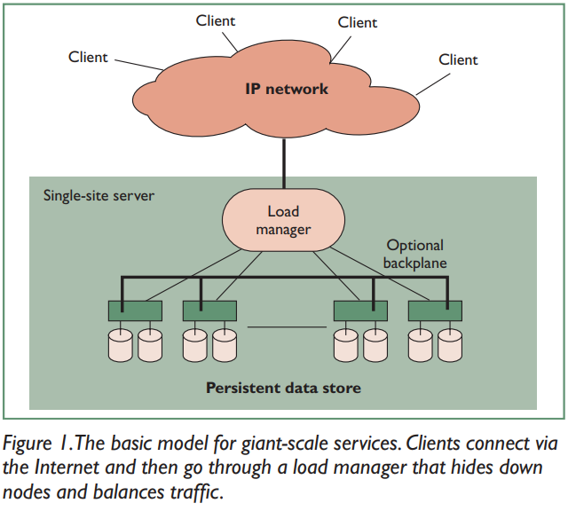
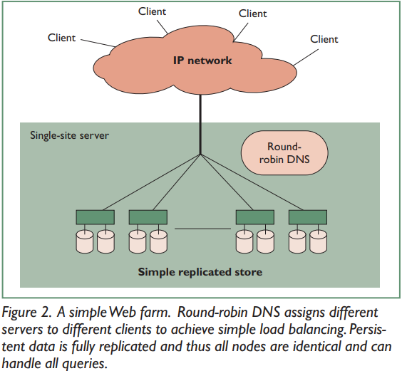
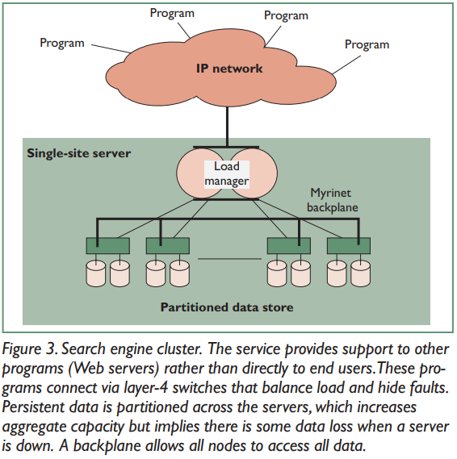

<h1>Lessons from Giant-Scale Services</h1>
[Paper Link](https://people.eecs.berkeley.edu/~brewer/papers/GiantScale-IEEE.pdf)
The paper discusses the fundamental model for services that need to be constantly available, focusing on the primary challenges they encounter in the real world: high availability, evolution, and growth.
  <h2>Advantages of  giant-scale services</h2>
      - **Access Anywhere, Anytime:** enabling users to access services from various locations such as home, work, airports, etc.
	  - **Availability via Multiple Devices:** With most processing handled by the infrastructure, users can access services through devices like set-top boxes, network computers, and smartphones.
	  - **Lower Overall Cost:** While difficult to quantify, infrastructure services offer a fundamental cost advantage over designs based on stand-alone devices. 
	  - **Simplified Service Updates:** One of the most significant long-term advantages is the ability to upgrade existing services
	  <h3>Components</h3>
		
		Assuming that the above system is read heavy.  
		This basic model provides a framework for understanding the architecture of giant-scale sites, outlining the key components and their interactions to support the high demand and availability requirements of such services. 
		Below are the components of the Basic Model:
		- **Clients:** Initiators of queries to the services, including web browsers, standalone email readers, or programs using XML and SOAP.
		- **IP Network:** Provides access to the service, whether it's the public Internet or a private network like an intranet.
		- **Load Manager:** balancing load among active servers.
		- **Servers:** Perform the actual work, combining CPU, memory, and disks into replicable units.
		- **Persistent Data Store:** Replicated or partitioned "database" spread across servers' disks, including network-attached storage like external DBMSs or RAID storage.
		- **Many services also use a backplane.** This optional system-area-network handles interserver traffic such as redirecting client queries to the correct server or coherence traffic for the persistent data store.
	  <h3>Load Management</h3>
		While round-robin DNS balances load effectively, it doesn't hide inactive servers. Clients might continue to use down nodes until the DNS mapping expires, causing delays.
		 
		4-layer switches, these transport-layer switches understand TCP and port numbers, and can make decisions based on this information.
		Below image shows a 4-layer switch. The “clients” are actually other programs (typically Web servers) that use the smart-client approach to failover among different physical clusters, primarily based on load. 
		
		Because the persistent store is partitioned across servers, possibly without replication, node failures could reduce the store’s effective size and overall capacity. Furthermore, the nodes are no longer identical, and some queries might need to be directed to specific nodes. 
		This is typically accomplished using a layer-7 switch to parse URLs, but some systems, such as clustered Web caches, might also use the backplane to route requests to the correct node.4
  <h2>High Availability</h2>
    High availability is a major driving requirement behind giant-scale system design.
	<h3>Availability Metrics</h3>
	  The traditional metric for availability is uptime of the web service.
	  
  
    